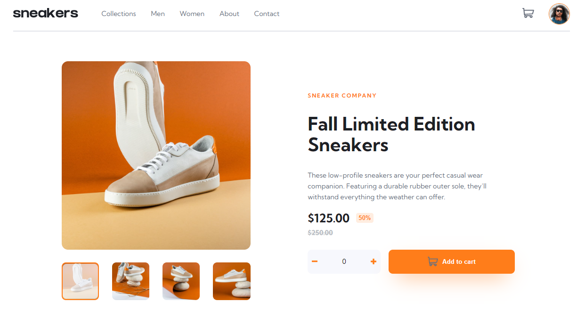
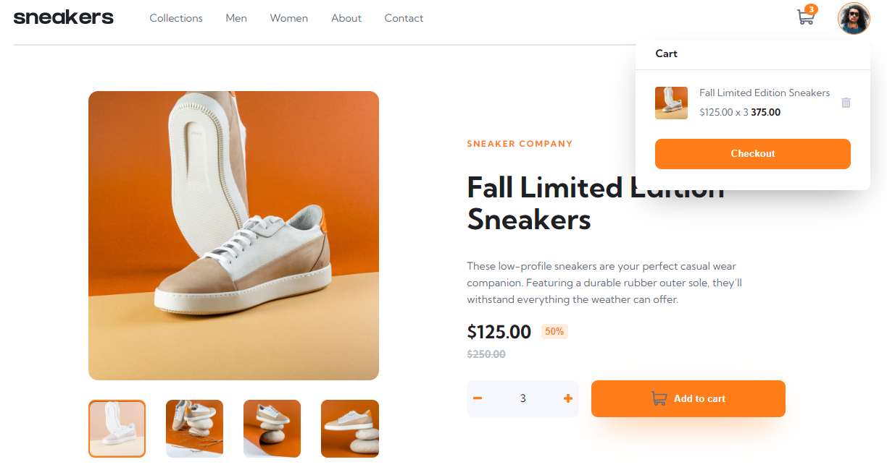
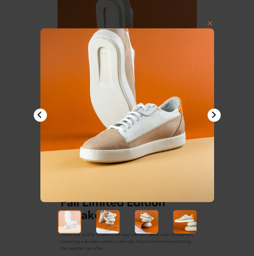
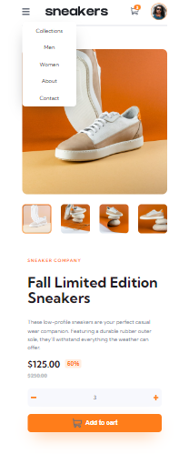

# Sneakers E-commerce Product Page

## Table of contents

- [Overview](#overview)
  - [The challenge](#the-challenge)
  - [Screenshot](#screenshot)
  - [Links](#links)
  - [Built with](#built-with)
- [Author](#author)

## Overview

### The challenge

Users should be able to:

- View the optimal layout for the site depending on their device's screen size
- See hover states for all interactive elements on the page
- Open a lightbox gallery by clicking on the large product image
- Switch the large product image by clicking on the small thumbnail images
- Add items to the cart
- View the cart and remove items from it

### Screenshot

### Links

- [Repository](https://github.com/clarencejulu/sneakers-product-page) 
- [Live Site](https://clarencejulu.github.io/sneakers-product-page/)

### Built with

- HTML
- CSS Preprocessor (SASS)
- Vanilla Javascript

## Author

- Frontend Mentor - [@clarencejulu](https://www.frontendmentor.io/profile/clarencejulu)
- Github - [My Github](https://github.com/clarencejulu)
- Website - 
- LinkedIn - [My LinkedIn Profile](https://www.linkedin.com/in/clarence-onumajulu/)
